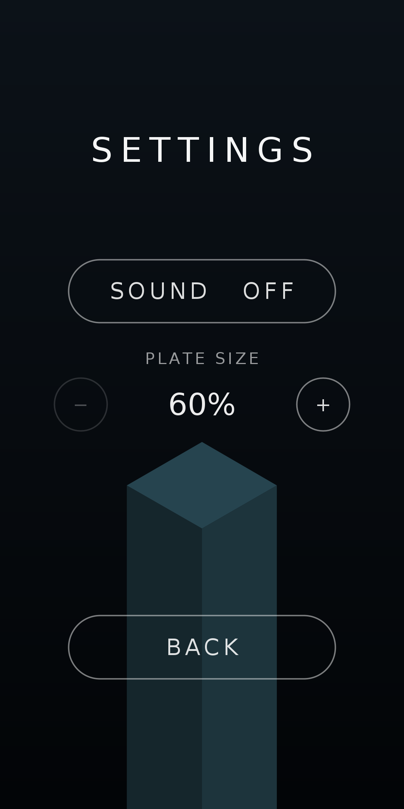
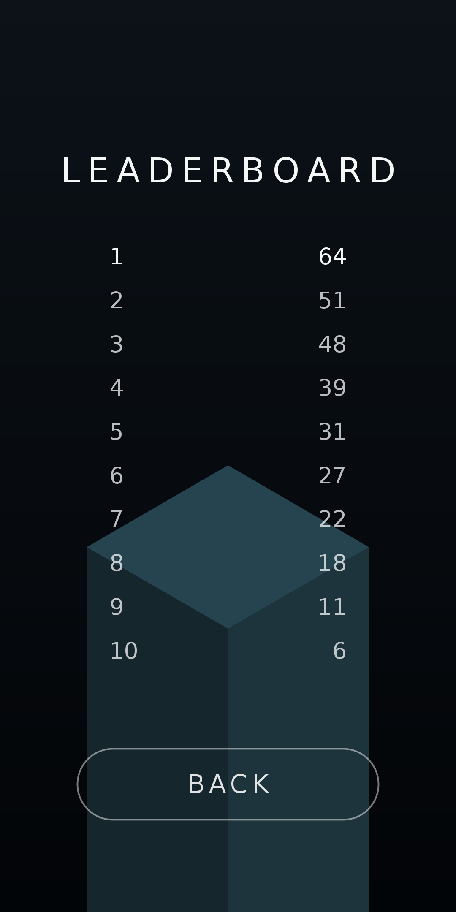
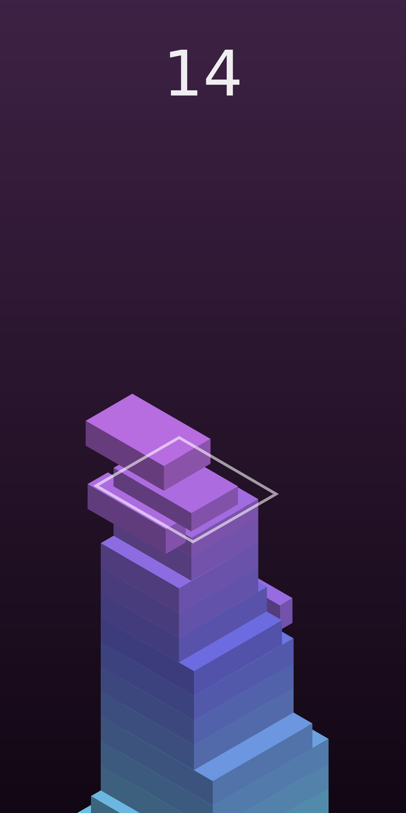
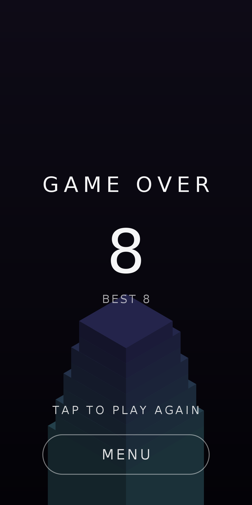

# Stacker

[](https://github.com/dtrouillet/stacker/actions/workflows/ci.yml)

Un jeu Android natif qui reprend le principe de *Stack* : des plaques glissent
au-dessus de la tour, vous touchez l'écran pour les poser, et tout ce qui
dépasse est tranché et tombe. Plus la tour monte, plus les plaques rétrécissent
et vont vite.

<p align="center">
  
  
  
  
  
</p>

## Le jeu

- Projection isométrique dessinée au `Canvas`, chaque bloc étant sa face
  supérieure éclairée plus ses deux faces visibles.
- Les plaques alternent entre l'axe X et l'axe Z, et font des allers-retours
  au-dessus de la tour.
- Une pose décalée tranche le débord, qui tombe en tournoyant. Une pose alignée
  au pixel près est un *perfect* : la taille est conservée, un anneau blanc
  s'échappe du bloc, et la note jouée monte d'un cran.
- Après six *perfects* d'affilée les plaques regrossissent, et à partir de huit
  elles regrossissent nettement plus vite, sans jamais dépasser la taille de
  départ.
- La vitesse monte doucement sur la durée, mais une ondulation la fait
  régulièrement redescendre pendant quelques plaques, au lieu de grimper sans
  répit.
- Les couleurs défilent en continu dans le cercle chromatique, et le dégradé du
  fond suit la teinte du bloc en cours.
- La caméra s'élève en douceur pour garder le sommet de la tour à hauteur fixe.
- Les bruitages sont synthétisés au lancement puis mis en cache : aucun fichier
  audio n'est embarqué.

## Écrans et options

L'écran titre ouvre sur trois choix : jouer, paramètres, classement. Le retour
système revient au titre avant de fermer le jeu, et la fin de partie propose un
bouton pour y retourner.

Les paramètres permettent de couper le son et de régler la taille de plaque de
départ, de 60 % à 140 % par pas de 20 %. Une plaque plus petite rend la partie
plus exigeante, et le socle affiché derrière le menu change de taille aussitôt.

Le classement garde les dix meilleurs scores, du plus élevé au plus faible, une
égalité étant tranchée en faveur de la partie la plus ancienne.

## Construire

Le projet est un projet Gradle Android standard. Il faut un SDK Android et un
JDK 17.

```
./gradlew assembleDebug        # app/build/outputs/apk/debug/app-debug.apk
./gradlew installDebug         # installe sur l'appareil branché
./gradlew test                 # tests unitaires JVM
```

Ou ouvrez simplement le dossier dans Android Studio.

| | |
|---|---|
| minSdk | 26 (Android 8.0) |
| targetSdk | 36 |
| compileSdk | 37 |
| Plugin Android Gradle | 9.4.1 |
| Gradle | 9.7.1 |
| Kotlin | fourni par le plugin Android |

Depuis le plugin Android 9, Kotlin est intégré: le projet ne déclare plus le
plugin `org.jetbrains.kotlin.android`, et la cible JVM suit `compileOptions`.

## Intégration continue et publication

Deux workflows GitHub Actions couvrent la chaîne complète.

`CI` tourne sur chaque push et chaque pull request : il vérifie l'empreinte du
wrapper Gradle, lance les tests unitaires des deux variantes, passe Android
Lint, puis construit l'APK debug et l'APK release non signé, ce dernier pour
prouver que R8 produit encore un paquet. L'APK debug, les rapports de tests et
le rapport de lint sont publiés comme artefacts du run, et les findings de lint
remontent dans l'onglet code scanning quand il est activé.

`Release` se déclenche sur un tag `v*`, ou à la main depuis l'onglet Actions. Il
construit l'APK et l'app bundle signés, vérifie la signature avec `apksigner`,
crée la release GitHub avec les deux fichiers attachés, et envoie l'APK aux
testeurs Firebase App Distribution si les secrets correspondants existent. Le
`mapping.txt` de R8 reste un artefact privé du run.

Le numéro de version vient du tag : `v1.2.3` donne le `versionName` `1.2.3` et
le `versionCode` `10203`.

La marche à suivre complète, de la création de la clé de signature aux secrets à
déclarer, est dans [docs/RELEASING.md](docs/RELEASING.md).

## Organisation du code

| Dossier | Rôle |
|---|---|
| `game/` | Simulation pure, sans dépendance Android : blocs, découpe, combos, vitesse, caméra, palette, projection isométrique, options, classement |
| `ui/` | Géométrie des menus et détection des appuis, pure elle aussi |
| `render/` | Dessin de la scène, du score et des pages de menu sur un `Canvas` |
| `view/` | `SurfaceView`, boucle de jeu sur un thread dédié, navigation entre écrans |
| `audio/` | Synthèse des bruitages et lecture via `SoundPool` |
| `data/` | Persistance des options et du classement |

Les paquets `game` et `ui` ne dépendent que de la bibliothèque standard Kotlin,
donc la mécanique du jeu comme le placement des boutons sont testés sur la JVM
dans `app/src/test`.

## Réglages

Tous les paramètres de gameplay sont regroupés dans `GameConfig` : vitesse de
départ, pente et ondulation de la courbe de vitesse, tolérance du *perfect*,
les deux seuils de regrossissement et leurs pas, hauteur des plaques, amplitude
du va-et-vient, gravité. Les deux règles qui en découlent, `speedFor` et
`growthFor`, vivent au même endroit et sont testées directement. La géométrie de la vue
vit dans `IsoProjection` : largeur de la tour à l'écran et hauteur de la ligne
d'horizon.

## Captures

Les images ci-dessus sont rendues hors ligne à partir du code du jeu lui-même
(`IsoProjection`, `Palette`, `StackGame` et `MenuLayout`), pas capturées sur un
appareil. Le placement des boutons y est donc celui de l'application.
