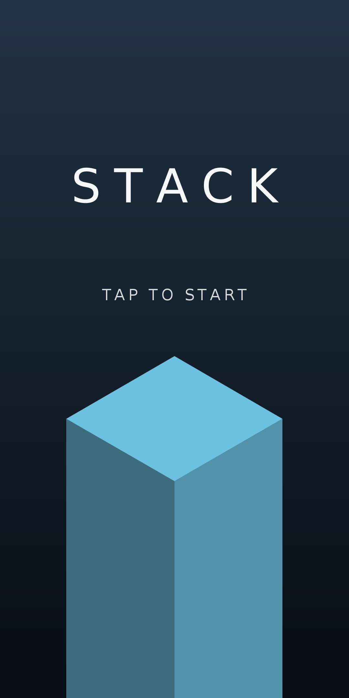
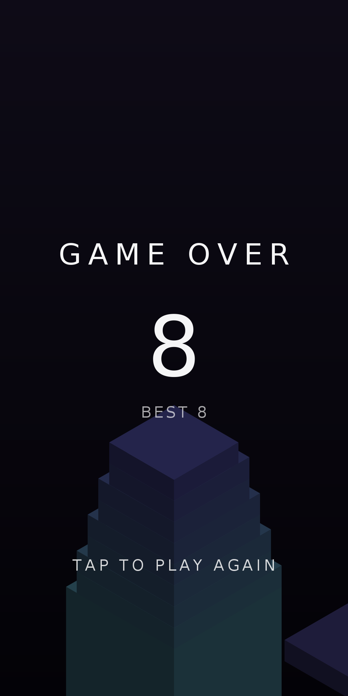

# Stacker

Un jeu Android natif qui reprend le principe de *Stack* : des plaques glissent
au-dessus de la tour, vous touchez l'écran pour les poser, et tout ce qui
dépasse est tranché et tombe. Plus la tour monte, plus les plaques rétrécissent
et vont vite.

<p align="center">
  
  
  
</p>

## Le jeu

- Projection isométrique dessinée au `Canvas`, chaque bloc étant sa face
  supérieure éclairée plus ses deux faces visibles.
- Les plaques alternent entre l'axe X et l'axe Z, et font des allers-retours
  au-dessus de la tour.
- Une pose décalée tranche le débord, qui tombe en tournoyant. Une pose alignée
  au pixel près est un *perfect* : la taille est conservée, un anneau blanc
  s'échappe du bloc, et la note jouée monte d'un cran.
- Après six *perfects* d'affilée, les plaques regrossissent, sans jamais
  dépasser la taille d'origine.
- Les couleurs défilent en continu dans le cercle chromatique, et le dégradé du
  fond suit la teinte du bloc en cours.
- La caméra s'élève en douceur pour garder le sommet de la tour à hauteur fixe.
- Le meilleur score est conservé entre les parties.
- Les bruitages sont synthétisés au lancement puis mis en cache : aucun fichier
  audio n'est embarqué.

## Construire

Le projet est un projet Gradle Android standard. Il faut un SDK Android et un
JDK 17.

```
./gradlew assembleDebug        # app/build/outputs/apk/debug/app-debug.apk
./gradlew installDebug         # installe sur l'appareil branché
./gradlew test                 # tests unitaires JVM
```

Ou ouvrez simplement le dossier dans Android Studio.

| | |
|---|---|
| minSdk | 26 (Android 8.0) |
| targetSdk / compileSdk | 35 |
| Plugin Android Gradle | 8.7.3 |
| Kotlin | 2.0.21 |
| Gradle | 8.11.1 |

## Organisation du code

| Dossier | Rôle |
|---|---|
| `game/` | Simulation pure, sans dépendance Android : blocs, découpe, combos, caméra, palette, projection isométrique |
| `render/` | Dessin de la scène et de l'interface sur un `Canvas` |
| `view/` | `SurfaceView` et boucle de jeu sur un thread dédié |
| `audio/` | Synthèse des bruitages et lecture via `SoundPool` |
| `data/` | Persistance du meilleur score |

Le paquet `game` ne dépend que de la bibliothèque standard Kotlin, donc toute la
mécanique du jeu est testée sur la JVM dans `app/src/test`.

## Réglages

Tous les paramètres de gameplay sont regroupés dans `GameConfig` : vitesse de
départ et accélération, tolérance du *perfect*, seuil et pas de regrossissement,
hauteur des plaques, amplitude du va-et-vient, gravité. La géométrie de la vue
vit dans `IsoProjection` : largeur de la tour à l'écran et hauteur de la ligne
d'horizon.

## Captures

Les images ci-dessus sont rendues hors ligne à partir du code de géométrie du
jeu (`IsoProjection`, `Palette` et `StackGame`), pas capturées sur un appareil.
